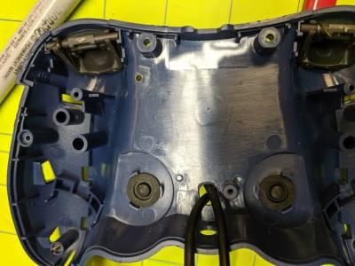
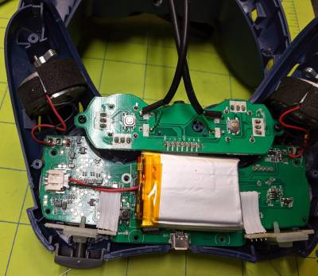
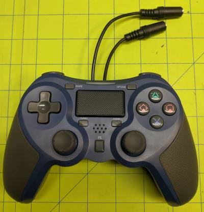
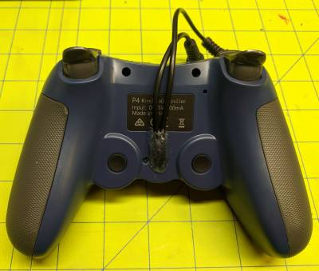
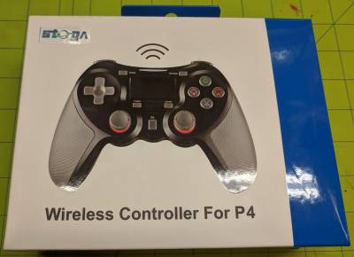

# Adapted-Controller
Instructions for Adapting a controller

A client requested some adaptations to a PS4 controller. The problem is that they couldn't press the “buttons” on the small joysticks. It was asked if we could add two jacks to accept capability switches for easier actuation of these two actions.

After opening up the controller, the contacts were located for the two switches. A hole was drilled through the back cover for two pigtale jacks to be installed. Cables were hotglued in place and returned to its original packaging.

  
  
  
  
  