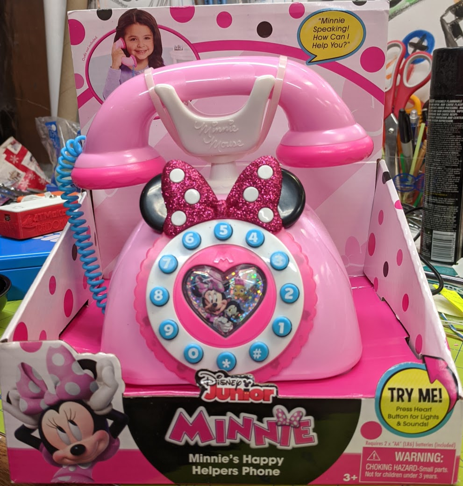
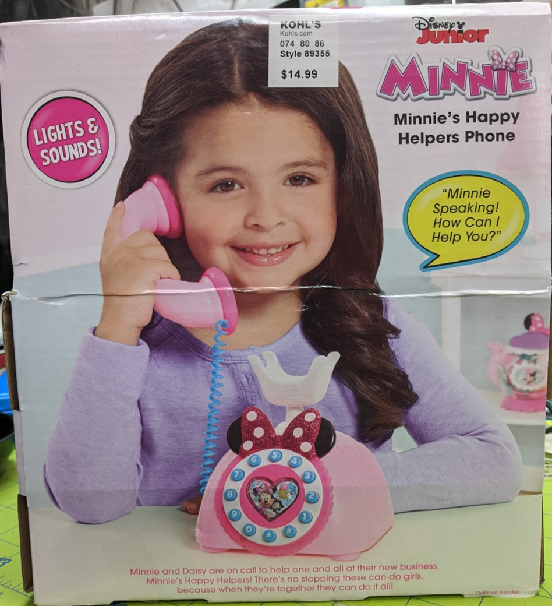
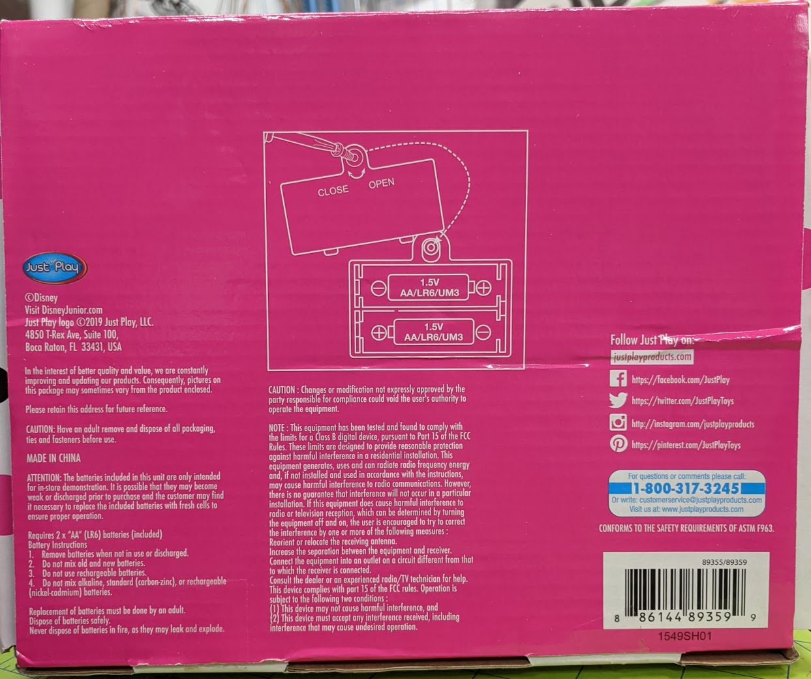
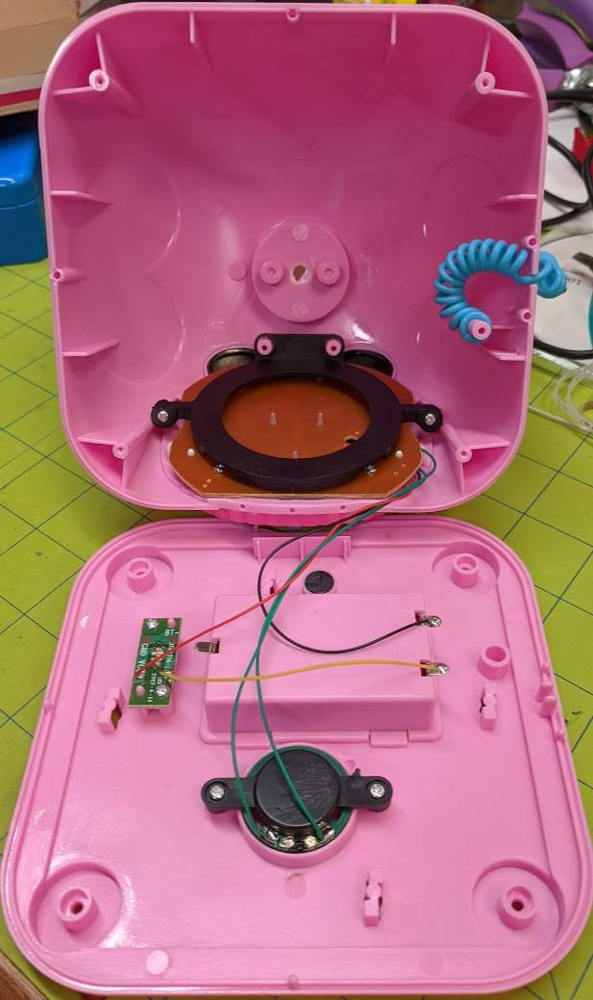
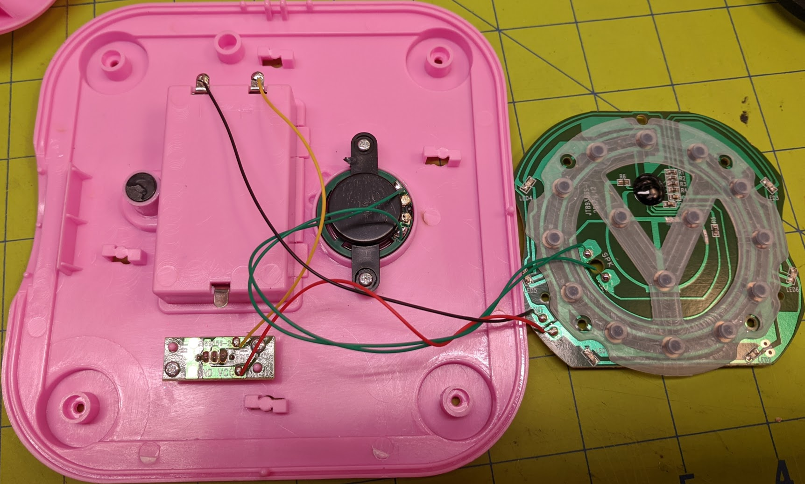
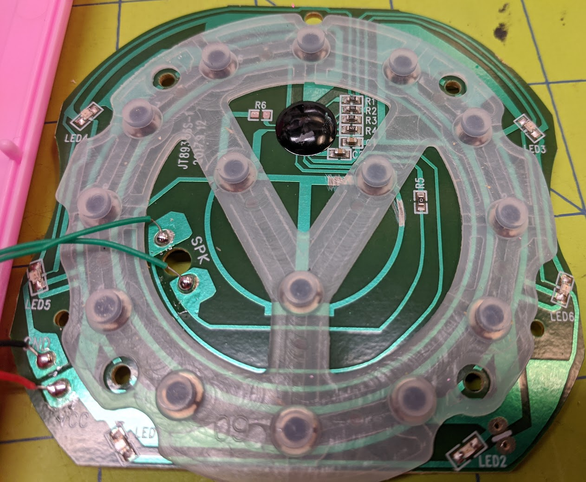
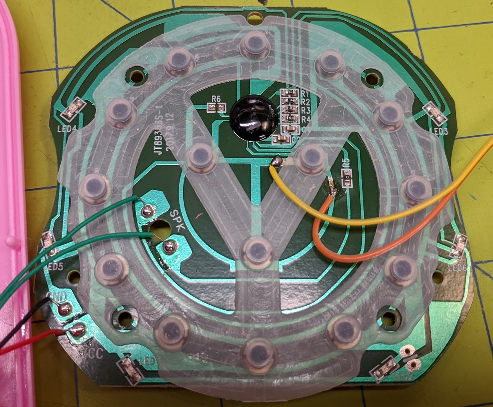
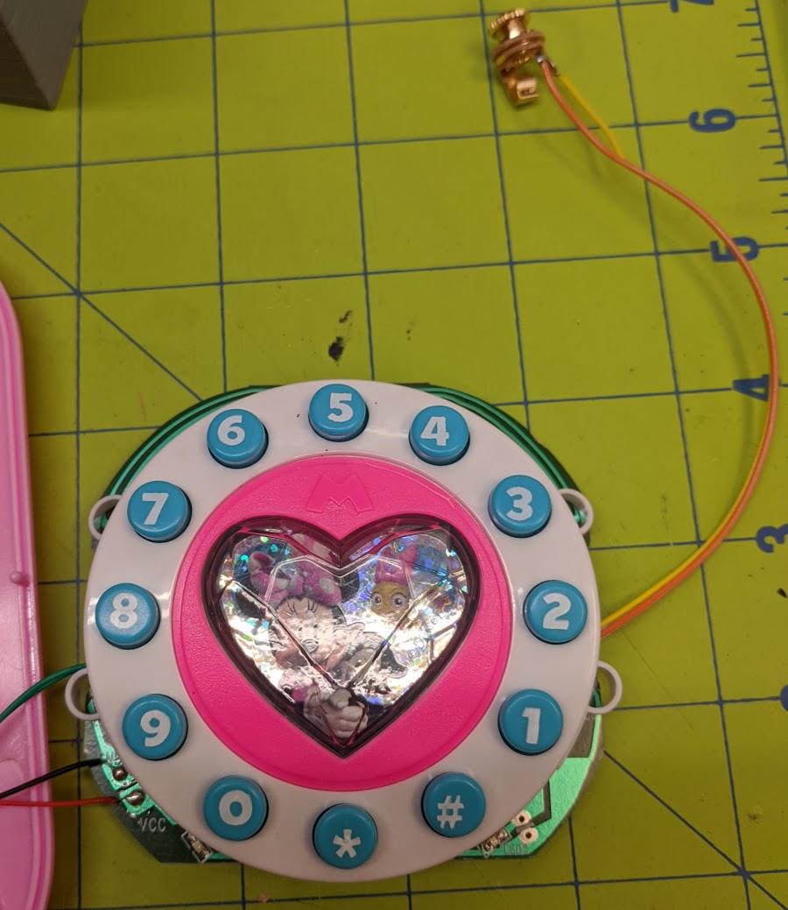

# Disney Minnie's Happy Helpers Phone

  
  
  
  1. Remove from packaging
  2. Remove 4 screws on bottom   
  
  3. Remove 2 screws in circuit board bracket  
  4. Remove 4 screws holding circuit board to front dial   
  
  5. Scratch away the solder mask as shown   
  
  6. Solder leads for 1/8" jack to cleaned copper traces   
  
  7. Run new wires out side and reassemble   
   
  8. Drill hole in side or back of phone and mount jack  
  9. Finish reassembly  
  10. Test  
  11. Put back in packaging  